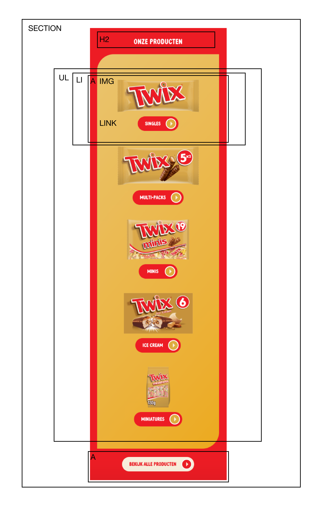
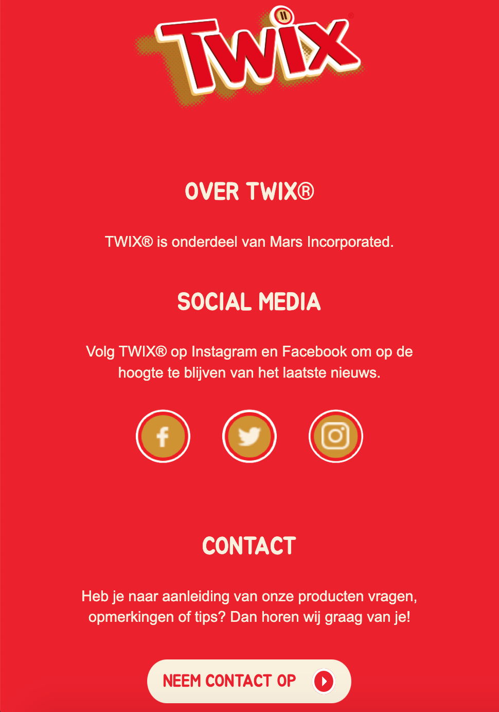

# Procesverslag

## Jij

  
uitwerken voor kick-off werkgroep

  ### Auteur:
  Maeve Poelhekke

  #### Je startniveau:
  Blauw

  #### Je focus:
  Responsive

## Je website

  
uitwerken voor kick-off werkgroep

  ### Je opdracht:
  <a href="https://www.twix.nl/>

  #### Screenshot(s) van de eerste pagina (small screen): 
  Twix - home pagina 
  

  #### Screenshot(s) van de tweede pagina (small screen):
  Twix - historie pagina   
  

## Toegankelijkheidstest 1/2 (week 1)

  
uitwerken na test in 1e werkgroep

  ### Bevindingen
  Goed toegankelijke website. 

  #### Screenreader
  Screenreader is duidelijk en neemt je er goed doorheen. 

  #### Muis en Toetsenbord 
  Je tabt er goed doorheen, alles wordt op een logisch volgorde geselecteerd. Alleen zijn er geen sates, die zouden een handige toevoeging zijn. 

  Om dit op te lossen kan je states toevoegen.

  #### Motoriek (shocks, elastiekjes)
  In de footer staan de linkjes in de navigatie behoorlijk dicht op elkaar en is de tekst redelijk klein, je moet als je motorieke problemen hebt behoorlijk secuur klikken. Je kan makkelijk perongeluk op een ander link klikken. 

  Om dit op te lossen kan je meer witruimte tussen de linkjes creëren en de font groter maken. 

  #### Visueel (brillen, contrast, kleurenblind, dark/light). 
  Met low contrast zijn sommige teksten niet even goed te lezen. Komt door de lettergrootte en de kleur van de tekst in combinatie met de achtergrondkleur of foto. 

  Om dit op te lossen kan je de lettergrootte en/of de tekstkleur/font-weight aanpassen.

## Breakdownschets (week 1)

  
uitwerken na afloop 2e werkgroep

  ### de hele pagina: 
  
  

  ### dynamisch deel (bijv menu): 
  

  ### wellicht nog een dynamisch deel (bijv filter): 
  

## Voortgang 1 (week 2)

  
uitwerken voor 1e voortgang

  ### Stand van zaken
  Goed opweg met de code, nu verder de html afschrijven. HTML schrijven ging goed, had moeite met de de nav maar heeft Jeffrey mij mee kunnen helpen. Verder een paar kleine puntjes die ik moest aanpassen, code was verder goed. Was als laatste dus hadden helaas een beetje kort de tijd maar hebben de breakdownschetsen door kunnen nemen en de code ook.

  ### Agenda voor meeting

  Vragen:

  - Is de sectie 'onze producten' en 'history' een unorderd list of allemaal secties binnen de sectie?  
  - Hoe kan ik de navigatie handig indelen?       

  ### Verslag van meeting
  Ging per persoon de voortgang bespreken, dus iedereen stelde los zijn/haar vragen.

  - Was als laatste dus hadden helaas een beetje kort de tijd maar hebben de breakdownschetsen door kunnen nemen en de code ook.
  - Had problemen met de nav, hoe ik die moest indelen maar weet nu hoe ik nu verder moet.
  - Alle vragen zijn beantwoord.
  - Code zag er goed uit.

## Voortgang 2 (week 3)

  
uitwerken voor 2e voortgang

  ### Stand van zaken
  Vond het lastig om een begin te maken met CSS, wist niet zo goed waar ik moest beginnen. Voelde een beetje dat ik zo veel nog moest doen dat ik niet zo goed wist waar ik moest beginnen. Had wat verduidelijking nodig voor de css selectoren. 

  ### Agenda voor meeting
  Vragen:

  - Wanneer moet je welke css selectoren gebruiken?
  - Hoe deel je de stylesheet logisch in?
  - Mag je id's gebruiken bij images?

  ### Verslag van meeting
  Bij deze meeting hebben we problemen als een groep besproken. Niet iedereen persoonlijk. We hebben het gehad over css selectoren en hoe je een een background image aan je header kan toevoegen. 

## Toegankelijkheidstest 2/2 (week 4)

  
uitwerken na test in 8e werkgroep

  

  #### Screenreader
  Bij sommige afbeeldingen was ik vergeten bij alt een beschrijving toe te voegen. Ook had ik afbeeldingen en dan H1 of H2.

  Om dit op te lossen heb ik bij elke afbeelding een beschrijving gezet en is de volgorde van afbeelding en kopje nu goed.

  #### Muis en Toetsenbord 
  Je tabt er goed doorheen, alles wordt op een logisch volgorde geselecteerd. Alleen zijn er geen sates, die zouden een handige toevoeging zijn. 

  Om dit op te lossen heb ik hover states toegevoegd. 

  
  

  #### Motoriek (shocks, elastiekjes)
  In de footer staan de linkjes in de navigatie behoorlijk dicht op elkaar en is de tekst redelijk klein, je moet als je motorieke problemen hebt behoorlijk secuur klikken. Je kan makkelijk perongeluk op een ander link klikken. 

  Om dit op te lossen heb ik de meer witruimte tussen de linkjes gecreëerd en de font groter gemaakt. 
  
  

  #### Visueel (brillen, contrast, kleurenblind, dark/light). 
  Met low contrast zijn sommige teksten niet even goed te lezen. Komt door de lettergrootte/dikte en de kleur van de tekst in combinatie met de achtergrondkleur of foto. 

  Om dit op te lossen heb ik heb ik de de fontweight en tekstkleur aangepast.

  

## Voortgang 3 (week 4)

  
uitwerken voor 3e voortgang

  ### Stand van zaken
  Ik ben zeker op weg maar er moet nog veel gebeuren, zijn ook een aantal dingen waar ik tegen aan loop. 

  ### Agenda voor meeting
  
  Vragen
  - Hoe maak ik de tijdlijn op de historie pagina?
  - Hoe zorg ik ervoor dat foto's worden verborgen op een website. 

  ### Verslag van meeting
  Jeffrey is door mijn pagina gelopen en heeft getest of het toegankelijk is en gekeken of de code semantisch correct is. Heb verder antwoord op mijn vragen gekregen en kan weer verder aan de slag. 

## Eindgesprek (week 5)

  
uitwerken voor eindgesprek

  ### Je uitkomst - karakteristiek screenshots:
  
  
  
  
  

  ### Dit ging goed/Heb ik geleerd: 
  Flexen ging goed, al helemaal bij de section onze producten en twix straw challenge.

  

  ### Dit was lastig/Is niet gelukt:
  De Twix straw challenge section heeft een bepaalde achtergrond met patroon die ik achterwege heb gelaten. 
  De cookie settings button rechts onderin laten uitlijnen. Stelde het eerlijk gezegd steeds uit en nu ik nog 
  beperkt de tijd heb voor dat ik het moet inleveren ga ik het niet meer proberen. 

  

  Wat ik lastig vond was de tijdlijn op de historie pagina. Ik had een tip gekregen van Jeffrey hoe ik dat kon aanpakken en dat is mij ook aardig gelukt. Alleen was die manier niet responsive en ik koos zelf voor die uitwerking. Vervolgens heeft Sanne mij geholpen en is het gelukt met behulp van Sanne.

  

## Bronnenlijst

  
continu bijhouden terwijl je werkt

  Nb. Wees specifiek ('css-tricks' als bron is bijv. niet specifiek genoeg).

  1. https://www.w3schools.com/ - hoe gebruik ik z-index, hoe gebruik ik Media Queries, 
     kijken welke selector ik moet gebruiken
  2. https://css-tricks.com/ - wanneer gebruik ik justify content of align-items. 
  3. HTML/CSS boek van Jon Duckett - opfrisser voor de basics.
  4. https://nekocalc.com/px-to-em-converter - om px naar em om te zetten
  5. Nienke - heeft me geholpen met mijn hamburger menu
  6. Sanne & Jeffrey ;)

