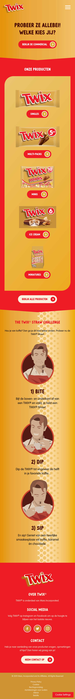
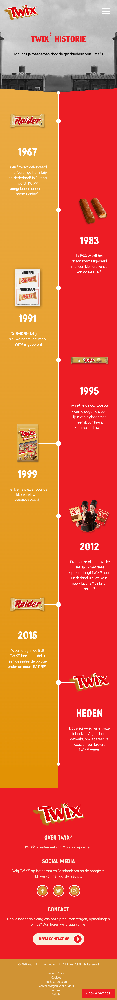
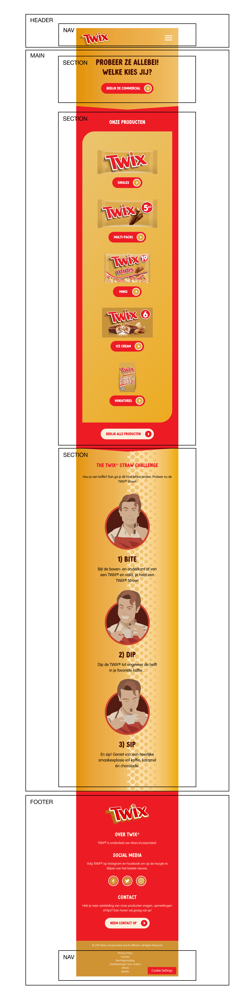
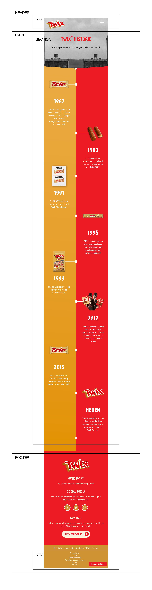
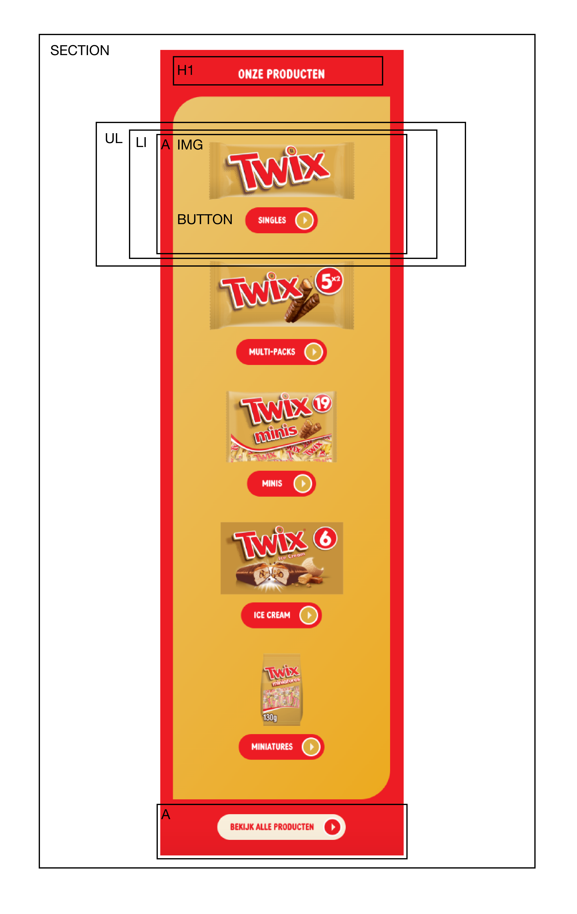
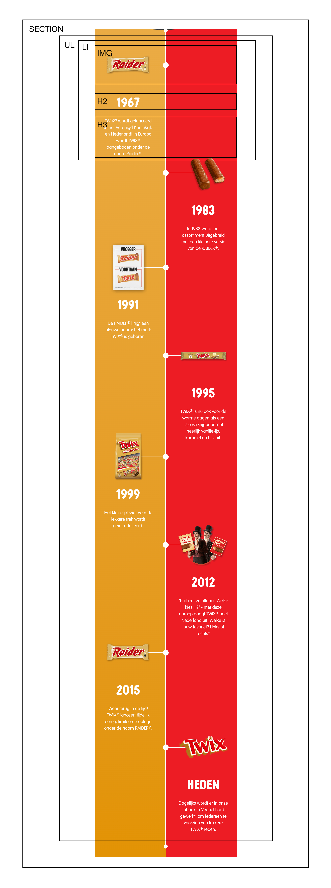

# Procesverslag
Markdown is een simpele manier om HTML te schrijven.  
Markdown cheat cheet: [Hulp bij het schrijven van Markdown](https://github.com/adam-p/markdown-here/wiki/Markdown-Cheatsheet).

Nb. De standaardstructuur en de spartaanse opmaak van de README.md zijn helemaal prima. Het gaat om de inhoud van je procesverslag. Besteedt de tijd voor pracht en praal aan je website.

Nb. Door *open* toe te voegen aan een *details* element kun je deze standaard open zetten. Fijn om dat steeds voor de relevante stuk(ken) te doen.

## Jij

  
uitwerken voor kick-off werkgroep

  ### Auteur:
  Maeve Poelhekke

  #### Je startniveau:
  Blauw

  #### Je focus:
  Responsive
 

## Je website

  
uitwerken voor kick-off werkgroep

  ### Je opdracht:
  link naar de website die je gaat namaken óf de naam/omschrijving van je eigen ontwerp

  #### Screenshot(s) van de eerste pagina (small screen): 
  Twix - home pagina 
  

  #### Screenshot(s) van de tweede pagina (small screen):
  Twix - historie pagina   
  
 

## Toegankelijkheidstest 1/2 (week 1)

  
uitwerken na test in 1e werkgroep

  ### Bevindingen
  Lijst met je bevindingen die in de test naar voren kwamen:

  #### Screenreader
  Hier korte omschrijving (met indien nodig afbeeldingen)

  Hier een omschrijving van hoe het opgelost kan worden (met indien nodig afbeeldingen)

  #### Muis en Toetsenbord 
  Hier korte omschrijving (met indien nodig afbeeldingen)

  Hier een omschrijving van hoe het opgelost kan worden (met indien nodig afbeeldingen)

  #### Motoriek (shocks, elastiekjes)
  Hier korte omschrijving (met indien nodig afbeeldingen)

  Hier een omschrijving van hoe het opgelost kan worden (met indien nodig afbeeldingen)

  #### Visueel (brillen, contrast, kleurenblind, dark/light). 
  Hier korte omschrijving (met indien nodig afbeeldingen)

  Hier een omschrijving van hoe het opgelost kan worden (met indien nodig afbeeldingen)

## Breakdownschets (week 1)

  
uitwerken na afloop 2e werkgroep

  ### de hele pagina: 
  
  

  ### dynamisch deel (bijv menu): 
  

  ### wellicht nog een dynamisch deel (bijv filter): 
  

## Voortgang 1 (week 2)

  
uitwerken voor 1e voortgang

  ### Stand van zaken
  Goed opweg met de code, nu verder de html afschrijven. HTML schrijven ging goed, had moeite met de de nav maar heeft Jeffrey mij mee kunnen helpen. Verder een paar kleine puntjes die ik moest aanpassen, code was verder goed. Was als laatste dus hadden helaas een beetje kort de tijd maar hebben de breakdownschetsen door kunnen nemen en de code ook.

  ### Agenda voor meeting
  samen met je groepje opstellen

  | Maeve      | Nienke          | Tess   | Thijs       |
  | ---            | ---                | ---          | ---              |
  | Is de sectie 'onze producten' en 'history' een unorderd list of allemaal secties binnen de sectie?  | Verschillende stukken code wordt gezien als link dat doorlinkt naar mijn andere html pagina, in de code kunnen we dit niet vinden             | Moet ik de agenda en de filterfunctie werkend krijgen en zo niet hoe moet ik dit laten zien?   | en dan ik dat    |
  | en dat ook nog | Is de introductie afbeelding en h1 nog een stuk van de header of niet? | nog een punt | dit wil ik zeker |
  | ...            | Kan een h2 boven een h1 in de html omdat de h1 belangrijker is maar visueel wel onderin staat?                | ...          | ...              |

  ### Verslag van meeting
  Ging per persoon de voortgang bespreken, dus iedereen stelde los zijn/haar vragen.

  - Was als laatste dus hadden helaas een beetje kort de tijd maar hebben de breakdownschetsen door kunnen nemen en de code ook.
  - Had problemen met de nav, hoe ik die moest indelen maar weet nu hoe ik nu verder moet.
  - Alle vragen zijn beantwoord.
  - Code zag er goed uit.

## Voortgang 2 (week 3)

  
uitwerken voor 2e voortgang

  ### Stand van zaken
  Vond het lastig om een begin te maken met CSS, wist niet zo goed waar ik moest beginnen. Voelde een beetje dat ik zo veel nog moest doen dat ik niet zo goed wist waar ik moest beginnen. Had wat verduidelijking nodig voor de css selectoren. 

  ### Agenda voor meeting
  samen met je groepje opstellen

  | Maeve      | Tess         | student 3    | student 4        |
  | ---            | ---                | ---          | ---              |
  | Wanneer moet je welke css selectoren gebruiken? | Moet je bij elke section beginnen met een h1? | en ik dit    | en dan ik dat    |
  | Hoe deel je de stylesheet logisch in? | Wanneer moet je welke css selectoren gebruiken? | nog een punt | dit wil ik zeker |
  | Mag je id's bij img's gebruiken? | ...                | ...          | ...              |

  ### Verslag van meeting
  Bij deze meeting hebben we problemen als een groep besproken. Niet 

  - punt 1
  - punt 2
  - nog een punt
- ...

## Toegankelijkheidstest 2/2 (week 4)

  
uitwerken na test in 8e werkgroep

  ### Bevindingen
  Lijst met je bevindingen die in de test naar voren kwamen (geef ook aan wat er verbeterd is):

  #### Screenreader
  Hier korte omschrijving (met indien nodig afbeeldingen)

  Hier een omschrijving van hoe het opgelost kan worden (met indien nodig afbeeldingen)

  #### Muis en Toetsenbord 
  Je tabt er goed doorheen, alles wordt op een logisch volgorde geselecteerd. Alleen zijn er geen sates, die zouden een handige toevoeging zijn. 

  #### Motoriek (shocks, elastiekjes)
  In de footer staan de linkjes in de navigatie behoorlijk dicht op elkaar en is de tekst redelijk klein, je moet als je motorieke problemen hebt behoorlijk secuur klikken. Je kan makkelijk perongeluk op een ander link klikken. 

  Om dit op te lossen heb ik de meer witruimte tussen de linkjes gecreëerd en de font groter gemaakt. 

  #### Visueel (brillen, contrast, kleurenblind, dark/light). 
  Met low contrast zijn sommige teksten niet even goed te lezen. Komt door de lettergrootte en de kleur van de tekst in combinatie met de achtergrondkleur of foto. 

  Om dit op te lossen heb ik heb ik de de lettergrootte en tekstkleur aangepast.

## Voortgang 3 (week 4)

  
uitwerken voor 3e voortgang

  ### Stand van zaken
  hier dit ging goed & dit was lastig (neem ook screenshots op van delen van je website en code)

  ### Agenda voor meeting
  samen met je groepje opstellen

  | student 1      | student 2          | student 3    | student 4        |
  | ---            | ---                | ---          | ---              |
  | dit bespreken  | en dit             | en ik dit    | en dan ik dat    |
  | en dat ook nog | dit als er tijd is | nog een punt | dit wil ik zeker |
  | ...            | ...                | ...          | ...              |

  ### Verslag van meeting
  hier na afloop snel de uitkomsten van de meeting vastleggen

  - punt 1
  - punt 2
  - nog een punt
  - ...

## Eindgesprek (week 5)

  
uitwerken voor eindgesprek

  ### Je uitkomst - karakteristiek screenshots:
  

  ### Dit ging goed/Heb ik geleerd: 
  Korte omschrijving met plaatjes

  

  ### Dit was lastig/Is niet gelukt:
  De Twix straw challenge section heeft een bepaalde achtergrond met patroon die ik achterwege heb gelaten. 
  De cookie settings button rechts onderin laten uitlijnen. Stelde het eerlijk gezegd steeds uit en nu ik nog 
  beperkt de tijd heb voor dat ik het moet inleveren ga ik het niet meer proberen. 

  

## Bronnenlijst

  
continu bijhouden terwijl je werkt

  Nb. Wees specifiek ('css-tricks' als bron is bijv. niet specifiek genoeg).

  1. https://www.w3schools.com/ - hoe gebruik ik z-index, hoe gebruik ik Media Queries, 
     kijken welke selector ik moet gebruiken
  2. https://css-tricks.com/ - wanneer gebruik ik justify content of align-items. 
  3. HTML/CSS boek van Jon Duckett - opfrisser voor de basics.
  4. https://nekocalc.com/px-to-em-converter - om px naar em om te zetten
  5. Sanne & Jeffrey ;)

